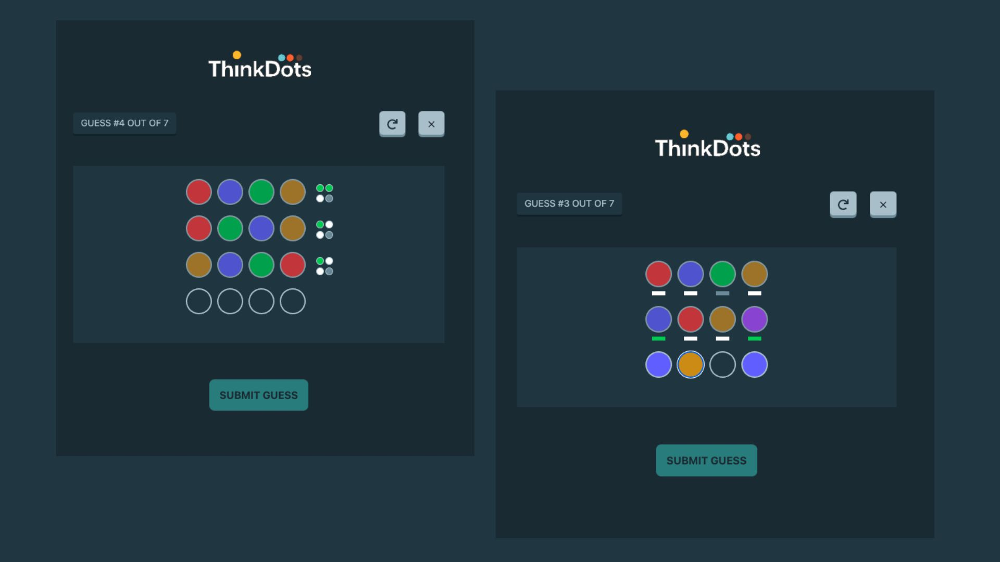

# ThinkDots

[](https://github.com/abolkog/thinkdots/actions)
[](LICENSE.md)
[](https://github.com/abolkog/thinkdots/pulls)

A simple, open-source color code-breaking game inspired by Giiker Super Decoder.

Guess the secret color sequence using logic and feedback. Can you crack the code?

[](https://abolkog.github.io/thinkdots/)

## Features

- Interactive color palette and code-breaking gameplay
- Feedback system: green for correct color & position, white for correct color wrong position, gray for absent color
- Multiple difficulty levels
- Responsive, accessible UI
- Built with React, Vite, and Tailwind CSS

## Screenshot



## How to Play

1. The game generates a secret color code.
2. Click each dot to select your guess for each position.
3. Submit your guess. You will receive feedback:
   - **Green dot:** Correct color in the correct position
   - **White dot:** Correct color, wrong position
   - **Gray dot:** Color not in the code
4. Use the feedback to refine your next guess.
5. Win by guessing the exact sequence before you run out of attempts!

### Feedback System

- **Easy Mode:**  
  After each guess, you receive feedback for every dot:

  - 🟢 **Green:** Correct color in the correct position.
  - ⚪ **White:** Correct color, wrong position.
  - ⚫ **Gray:** Color not in the code.

- **Pro Mode:**  
  After each guess, you receive only a summary for the whole row:
  - Example: “2 correct, 1 present” means two colors are correct and in the right position, and one color is correct but in the wrong position. You won’t know which dots are which.

## Run it locally

1. **Clone the Repo**

```shell
  git clone https://github.com/abolkog/thinkdots.git
  cd thinkdots
```

2. **Set up Node version (if using `nvm`):**

```shell
nvm use
```

3. **Install the dependencies**

```shell
npm i
```

4. **Start the dev server**

```shell
npm run dev
```

5. **Open [http://localhost:3000](http://localhost:3000) on your browser**.

## Contributing

Pull requests are welcome!  
For major changes, please [open an issue](https://github.com/abolkog/thinkdots/issues) first to discuss what you would like to change.

- Please make sure to update tests as appropriate.
- See [CONTRIBUTING.md](CONTRIBUTING.md) for guidelines

## Authors

- **Khalid Elshafie** - _Initial work_ - [abolkog](https://github.com/abolkog)

See also the list of [contributors](https://github.com/abolkog/thinkdots/contributors) who participated in this project.

## Design Reference

The UI design of this project is based on [g1alexander's Tic Tac Toe](https://github.com/g1alexander/tic-tac-toe).

## License

This project is licensed under the MIT License - see the [LICENSE.md](LICENSE.md) file for details
